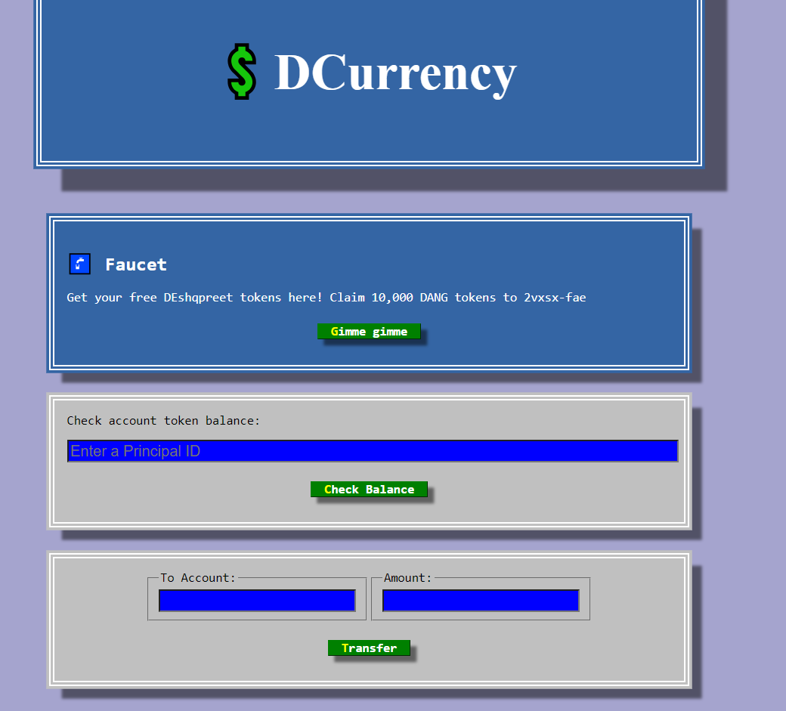

Welcome to my Crypto Token Website!

Embarking on this project has been an exhilarating journey, and I am delighted to share it with all of you. The frontend of this platform is developed using `React.js`, while the backend runs on the powerful` Motoko` language. Throughout this endeavor, I encountered various challenges that contributed to a truly valuable and educational experience.

I extend an invitation for you to explore and learn from this project, just as I did. If you are curious about running it on your local machine, I encourage you to visit the Dfinity Site, where you'll find helpful resources and guidance.

Furthermore, this project is directly linked to my `NFT Project`. In the NFT marketplace, we utilize CryptoCurrency for buying and selling NFTs, and that's where our creation, `DANG`, the Crypto Token, comes into play!

Thank you for being a part of this exciting endeavor, and I sincerely hope you find this website both informative and enjoyable! Feel free to reach out if you have any questions or feedback.


# Glimpse Of Project

**Here the Glipmse of my Project :-**



# To Deploy

1. Find out your principal id:

```
dfx identity get-principal
```

2. Replace the <REPLACE WITH YOUR PRINCIPAL> in main.mo with the principal you got from step 1.

```
  let owner : Principal = Principal.fromText("<REPLACE WITH YOUR PRINCIPAL>");
```

3. Open up a new terminal in this VSCode project and deploy the token canister:

```
dfx deploy
```

4. Start the frontend:

```
npm start
```

5. Set the canister id to a local variable:

```
CANISTER_PUBLIC_KEY="principal \"$( \dfx canister id token )\""
```

6. Transfer half a billion tokens to the canister Principal ID:

```
dfx canister call token transfer "($CANISTER_PUBLIC_KEY, 500_000_000)"
```

7. Claim the tokens from the faucet on the frontend website.

8. Get token canister id:

```
dfx canister id token
```
